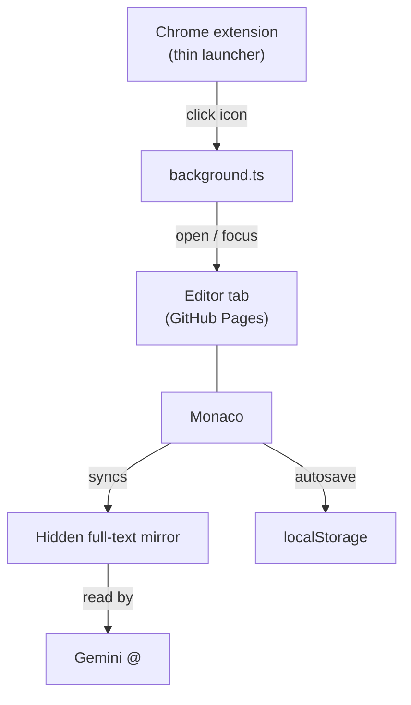

# Architecture

## Core constraint

Gemini in Chrome's `@` tab-context picker **excludes `chrome-extension://` pages by
URL scheme**. The editor must be a normal `https://` tab. Production hosts it on
GitHub Pages at `https://arverma.github.io/ConTextEditor/`.

Two parts, no local server:



## Extension — `manifest.json`, `src/background/background.ts`

- MV3, no popup, permission `"tabs"` only.
- Icon click: find an existing editor tab on the Pages host (including legacy
  `/editor.html`) and focus it; otherwise open a new one.
- Override with `VITE_EDITOR_ORIGIN` / `VITE_EDITOR_BASE` for local E2E.
- Built by `vite.extension.config.ts` → `dist/`.

## Editor — `src/editor/`

Built by `vite.editor.config.ts` → `dist-editor/` (`base: /ConTextEditor/`).
Deployed by `.github/workflows/deploy-pages.yml`.

| File | Role |
| --- | --- |
| `index.html` | Shell: topbar, sidebar, Monaco, preview, mirror, Privacy FAB |
| `public/editor.html` | Legacy redirect → `/` |
| `privacy.html` | Store privacy policy |
| `editor.ts` | Boot: theme, Edit/Preview, counts, export, autosave, mirror |
| `export.ts` | TXT download / `window.print` PDF |
| `monaco-setup.ts` | Worker, Markdown Monarch, find, Codicon CSS (no CDN) |
| `markdown-preview.ts` | `marked` + DOMPurify; lazy Mermaid for ` ```mermaid ` |
| `storage.ts` | `localStorage` note CRUD |
| `history-panel.ts` | Sidebar list |
| `editor.css` | Tokens, layout, print, Monaco find theming |

## Flow

1. Icon → open/focus Pages tab.
2. Load active note into Monaco; edits debounce-save and sync raw Markdown into
   `#full-text-mirror`.
3. Preview renders sanitized HTML (Mermaid only in Preview). Gemini still gets
   the raw source from the mirror.
4. User `@`-picks the Context Editor tab in Gemini.

## Hidden mirror

Monaco virtualizes the DOM — off-screen lines may be missing from the tree. The
mirror `<pre>` holds the **entire raw Markdown** with a visually-hidden clip
(not `display:none`) so tab-content extractors can see the full note.

## Storage

Keys on the Pages origin:

- `context-editor.snippets` → `Array<{ id, content, updatedAt }>`
- `context-editor.activeSnippetId`
- `context-editor.viewMode` → `"edit"` \| `"preview"`
- `context-editor.theme` → `"light"` \| `"dark"` (absent = system)

Titles are derived from the first line of `content` (ATX `#` stripped). Old
`title` / `createdAt` fields in stored JSON are ignored and dropped on rewrite.

## Theme

System / Light / Dark. CSS defaults dark on `:root`; `[data-theme="light"]`
overrides; `prefers-color-scheme` applies only when no explicit choice is set.
A tiny `<head>` script sets `data-theme` before paint. Monaco themes
`ce-dark` / `ce-light` match `--editor-bg`.

## Local development

```bash
npm run dev:editor          # or preview:editor
npm run build:extension     # load dist/ unpacked
# optional E2E:
VITE_EDITOR_ORIGIN=http://127.0.0.1:4173 VITE_EDITOR_BASE=/ConTextEditor npm run build:extension
```
