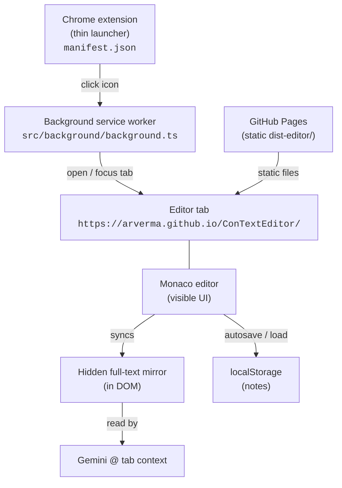

# Architecture

## The core constraint

The whole design is shaped by one finding: **Gemini in Chrome's tab-context "@"
picker excludes `chrome-extension://` pages by URL scheme.** It decides eligibility
from the tab's scheme, not its DOM — so an editor packaged as an extension page can
never be shared, no matter how its content is structured.

The workaround: serve the editor from a normal `https://` origin. Gemini accepts
plain http(s) tabs (matching how any regular web page is shareable). Production
uses GitHub Pages at `https://arverma.github.io/ConTextEditor/`.

So the product is split into two cooperating parts (no local background server).

## Components



### 1. Extension launcher — [`manifest.json`](../manifest.json), [`src/background/background.ts`](../src/background/background.ts)
- Manifest V3, `action` with **no popup** (so `chrome.action.onClicked` fires), and
  the single permission `"tabs"`. No `host_permissions` — it never touches other sites.
- On icon click: query tabs by the host pattern `https://arverma.github.io/*`,
  filter to the exact editor URL, and focus that tab + window if found; otherwise
  open a new one. This gives duplicate-free "reuse the tab" behavior.
- Override origin/base for local E2E via `VITE_EDITOR_ORIGIN` / `VITE_EDITOR_BASE`.
- Built by [`vite.extension.config.ts`](../vite.extension.config.ts) via
  `@crxjs/vite-plugin` into `dist/`.

### 2. Editor static site — [`src/editor/`](../src/editor)
Built by [`vite.editor.config.ts`](../vite.editor.config.ts) into `dist-editor/` with
`base: "/ConTextEditor/"` for GitHub project Pages. Deployed by
[`.github/workflows/deploy-pages.yml`](../.github/workflows/deploy-pages.yml).

| File | Responsibility |
| --- | --- |
| `index.html` | Page shell (Pages root): topbar, sidebar, Monaco, Markdown preview, Privacy FAB, hidden mirror. |
| `public/editor.html` | Legacy redirect → `/` so old `/editor.html` bookmarks keep working (copied as-is). |
| `privacy.html` | Privacy policy (Web Store listing URL; linked from the FAB). |
| `editor.ts` | Bootstraps Monaco (Markdown), Edit/Preview, counts, export, autosave + mirror sync, theme. |
| `export.ts` | Edit → `.txt` download; Preview → `window.print` (Save as PDF) with print CSS. |
| `monaco-setup.ts` | Monaco worker, Markdown Monarch, findController, Codicon CSS (bundled locally, no CDN). |
| `markdown-preview.ts` | Preview: `marked` → `DOMPurify`; ` ```mermaid ` fences → official `mermaid.run` (lazy-loaded). |
| `storage.ts` | `localStorage` CRUD for notes — the only module touching note storage. |
| `history-panel.ts` | Renders the sidebar note list; select/delete wiring. |
| `editor.css` | All styling, theme tokens, and Monaco find-widget theming. |

## Data / control flow

1. User clicks the toolbar icon → background worker opens/focuses the Pages tab.
2. The tab loads `index.html` from the Pages root (or Vite preview in local/dev).
3. `editor.ts` loads the active note from `localStorage` into Monaco (Markdown
   language); edits autosave (debounced) and continuously mirror raw Markdown into
   a hidden `<pre>` (see below). Edit | Preview toggles the visible pane; Preview
   renders sanitized HTML via `marked` + `DOMPurify`, then runs Mermaid on
   `.mermaid` blocks (Preview only; Gemini still gets the raw fence source).
4. User opens Gemini in Chrome, types `@`, selects the **Context Editor** tab; Gemini
   reads the tab's content as context.

## The hidden full-text mirror

Monaco **virtualizes** rendering — only lines near the viewport exist in the DOM. A
tab-content reader that only sees rendered text could miss a long document's
off-screen portion. So `editor.ts` mirrors the *entire* document into a `<pre
id="full-text-mirror">` on every change.

It's **visually hidden but kept in the DOM** (the `.visually-hidden` clip technique —
**not** `display:none`), so it stays in the text/accessibility tree for content
extraction while the user never sees it. The mirror always holds the **raw Markdown
source** — never Preview's rendered HTML — so Gemini still receives what the user
typed. Trade-off: if an extractor only reads strictly on-screen text, a very long
note could be truncated; for typical context sizes this is a non-issue.

## Storage / data model — [`storage.ts`](../src/editor/storage.ts)

`localStorage` keys (origin `https://arverma.github.io`):

- `context-editor.snippets` → `Array<{ id, title, content, createdAt, updatedAt }>`
- `context-editor.activeSnippetId` → `string | null`
- `context-editor.viewMode` → `"edit"` | `"preview"` (Edit/Preview toggle preference)

A single array under one key (no query/index needs; the list UI holds all in memory).
`getActiveSnippet` falls back to the most recent note if the active id is stale.

## Theme system

- Three modes: **System / Light / Dark**, persisted at `context-editor.theme`
  (`system` = key absent).
- CSS tokens live on `:root` (dark defaults). `:root[data-theme="light"]` is the
  explicit light override; a `prefers-color-scheme` media query applies light **only
  when no explicit choice is set** (System mode follows the OS; explicit choices win).
- A tiny synchronous script in `<head>` sets `data-theme` before first paint (no
  flash). `editor.ts` also swaps Monaco's theme (`ce-dark`/`ce-light`, whose
  backgrounds match `--editor-bg`) and, in System mode only, reacts to OS changes.

## Local development

Editor UI: `npm run dev:editor` (Vite HMR) or `npm run preview:editor` after a build.
Extension: `npm run build:extension` then load unpacked `dist/`. Point a local
build at the preview server with `VITE_EDITOR_ORIGIN` / `VITE_EDITOR_BASE` when
you need full end-to-end without Pages.

The heaviest memory consumer in the whole system is Monaco *inside the Chrome tab*,
which is user-opened and out of scope; Monaco was a deliberate product choice.
